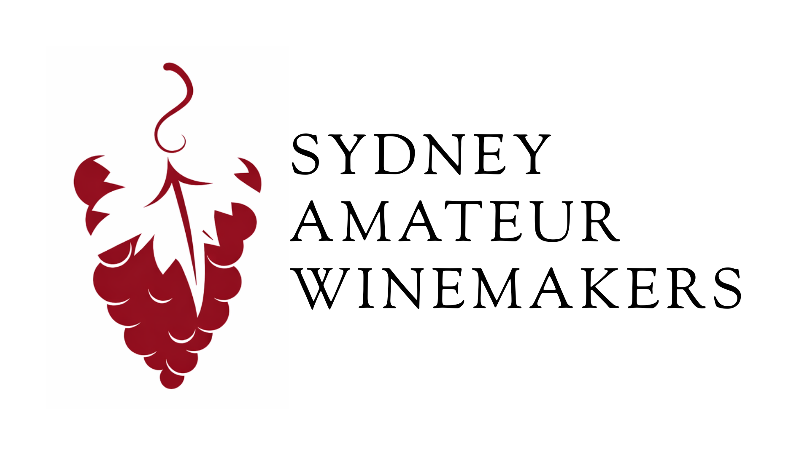

# Sydney Amateur Winemakers Club Brand Book

Canonical brand guidance for Sydney Amateur Winemakers Club.

This document is the source of truth for how the Sydney Amateur Winemakers Club presents itself across the website, event materials, competition communications, social media, newsletters, email, and short-form video. The PDF version should be regenerated from this file whenever the guidance changes.

## 1. Source Note and Confirmation Register

This brand book is based on the available club source material in the repository and public website materials that mirror the repository content.

Confirmed sources used:

- `index.html`: public website copy, club positioning, contact links, meeting location, podcast feature copy, joining prompts, Facebook group link, and calendar subscription language.
- `mead.html` and `mead-recipe-builder.html`: mead resource positioning, practical calculator language, metric-first educational tone, and feedback invitation language.
- `results.html` and `assets/data/results.json`: annual wineshow results language, judging/results terminology, competition page structure, and result-feed conventions.
- `assets/events.json`, `assets/calendar.ics`, and `assets/sawc-events.ics`: event, workshop, tasting, mini-competition, and calendar language.
- `assets/SAWC-Logo.png`: current supplied logo asset, 1920 x 1080 px, with the logo mark on the left and Sorts Mill Goudy text treatment.
- `style.css`: current website typography, colours, layout rules, cards, buttons, print handling, mobile behaviour, and results-page design tokens.
- `README.md` and `PRD.md`: project context, audience, site goals, accessibility, data workflows, and static-site constraints.
- `CHANGELOG.md`: confirmation that logo assets, Open Graph imagery, podcast features, and wineshow styling have been maintained in the repo history.

Unavailable or incomplete source types:

- Constitution, rules, governance documents: Needs confirmation.
- Newsletter or email examples: Needs confirmation.
- Official social media profile bios and historical posts beyond the Facebook group link and podcast links on the website: Needs confirmation.
- Membership fees, joining process beyond the mailing-list email prompt, member numbers, office holders, founding history, and formal awards history: Needs confirmation.

Rules for unclear facts:

- Do not invent dates, office holders, membership claims, award history, constitution details, or governance rules.
- If a claim cannot be traced to a confirmed source, write "Needs confirmation" next to it.
- Keep source files intact. The brand book interprets and documents existing materials; it does not replace governance documents or historical records.

## 2. Brand Foundation

Sydney Amateur Winemakers Club is a community of home winemaking enthusiasts in Sydney. The club gathers people who want to learn, share knowledge, taste together, improve practical skills, and celebrate the craft of amateur winemaking.

The identity is:

- Member-led: the club is built around shared participation, member knowledge, feedback, and contribution.
- Educational: the club helps people understand the art and science of wine, mead, judging, tasting, and practical production.
- Practical: communications should help members do something useful, such as attend a meeting, prepare a wine, understand a result, subscribe to the calendar, or improve a batch.
- Welcoming: beginners and experienced makers should both feel invited.
- Australian and local: language should feel natural in an Australian club context, with Sydney and Riverwood references used where relevant.
- Craft-focused: the tone should respect the work behind making, tasting, improving, judging, and sharing wine.

The brand should not feel:

- Corporate or bureaucratic.
- Luxury-led, exclusive, or prestige-heavy.
- Sales-driven or commercial.
- Trend-chasing, meme-heavy, or detached from real club activity.
- Overly formal in a way that makes beginners feel unwelcome.

Core brand idea:

Sydney Amateur Winemakers Club helps people turn curiosity into craft through shared winemaking knowledge, tastings, competitions, workshops, and community.

## 3. Purpose and Positioning

Purpose:

To bring Sydney home winemakers together to learn, taste, judge, improve, and share the craft of amateur winemaking.

Positioning statement:

Sydney Amateur Winemakers Club is a welcoming, practical, member-led club for people who make, taste, judge, or want to learn about wine and mead. It offers regular meetings, educational discussion, tastings, workshops, mini-competitions, calendar updates, and annual wineshow results in a plain, credible, accessible way.

What members and visitors should understand quickly:

- The club is for home winemaking enthusiasts in Sydney.
- Beginners are welcome.
- Experienced makers can contribute knowledge and improve through feedback.
- The club meets monthly at Club Rivers, Riverwood, according to current website copy.
- The club values tastings, competitions, workshops, judging, constructive criticism, and shared learning.
- The website is the public source for meeting information, calendar links, event updates, and wineshow results.

Do not claim:

- The club's founding date unless confirmed from governance records.
- Exact member counts unless confirmed from membership records.
- Official office holders unless confirmed from current governance records.
- Competition award history beyond data present in `assets/data/results.json` or confirmed judging sheets.

## 4. Audiences and Member Personas

Prospective beginner:

This person is curious about making wine or mead but may not know where to start. They need plain language, encouragement, meeting details, and a sense that questions are welcome. Avoid jargon without explanation.

Practical home winemaker:

This person already makes wine, mead, or fruit wine at home and wants better process, feedback, tasting experience, and community. They respond to specific topics such as yeast, stabilisation, fermentation, barrel samples, judging, and tasting notes.

Experienced contributor:

This person brings techniques, judging experience, equipment knowledge, vineyard or cellar knowledge, or workshop capability. Communications should invite contribution without making the club feel hierarchical.

Competition entrant or judge:

This person needs clear wineshow information, result labels, class names, judging language, filters, and credible presentation of outcomes. They value accuracy and source-backed results.

Event attendee:

This person needs date, time, location, activity, mini-competition details, calendar links, and any preparation notes. They may read quickly on mobile, so event communication must be direct.

Mead and experimental ferment user:

This person uses the mead resources and calculator material. They need metric-first, practical guidance and clear signals about what is validated, under development, or needing feedback.

## 5. Voice and Tone

The voice is knowledgeable, practical, friendly, and community-minded.

Write like:

- A club member explaining something clearly to another member.
- A capable educator who respects beginners.
- A practical maker who values evidence, tasting, and constructive feedback.
- An Australian community group, not a corporate brand.

Tone principles:

- Be clear before being clever.
- Use plain English and explain specialist terms when needed.
- Be specific about dates, venues, wine styles, and actions.
- Use active language: "Bring a sample", "Subscribe to the calendar", "Join the mailing list".
- Keep welcome and learning visible.
- Preserve humility when guidance is provisional.

Preferred words and phrases:

- home winemaking
- amateur winemaking
- members
- community
- learn, share, taste, judge, improve
- practical
- workshop
- tasting
- mini-competition
- constructive criticism
- metric-first, where discussing mead tools

Avoid:

- "exclusive", "elite", "premium lifestyle", "luxury experience"
- sales pressure or hype
- unexplained technical shorthand
- jokes that depend on internet trends
- claims of official status, history, or authority without source evidence

Examples:

Use: "Bring a bottle for constructive feedback and a chance to compare approaches with other members."

Avoid: "Showcase your premium handcrafted vintage in an exclusive tasting environment."

Use: "The calculator is still being validated, so please email feedback if a result does not match your hand calculations."

Avoid: "Our revolutionary tool guarantees perfect mead."

## 6. Naming and Usage Rules

Primary name:

- Sydney Amateur Winemakers Club

Abbreviation:

- SAWC may be used after the full name has appeared, or where space is limited, such as buttons, tables, filenames, and social captions.

Website-style shorthand:

- SydneyAWC appears in existing website copy. Use it only when matching that copy, a handle-style context, or a URL-associated label. Prefer the full name in formal documents.

Competition naming:

- Use "SAWC Show Results" when matching the current results-page language.
- Use "Sydney Amateur Winemakers Club Annual Wine Show" when describing the formal event name from results data.
- Do not change "wineshow" or "wine show" wording in source-derived copy unless a governance or competition source confirms the preferred form.

Capitalisation:

- Capitalise the full club name exactly: Sydney Amateur Winemakers Club.
- Use "home winemaking" in running copy.
- Use "mini-competition" with a hyphen.
- Use "mead" lower case unless part of a title.

Email and web:

- Public contact email in current website source: `sydneyawclub@gmail.com`.
- Public website in current footer source: `www.sydneyawc.com`.

Needs confirmation:

- Official social handles.
- Formal legal name, if different from the public club name.
- Incorporated association details, if any.

## 7. Logo Usage

Current preferred logo asset:

- `assets/SAWC-Logo.png`
- Format: PNG.
- Size: 1920 x 1080 px.
- Structure: logo mark on the left with the Sydney Amateur Winemakers Club text treatment to the right.
- Logo text treatment: Sorts Mill Goudy.

Use this PNG as the primary brand reference unless a future source establishes a different official logo suite.

Preferred use:

- Use the full logo when introducing the club in a brand book, presentation, event flyer, newsletter masthead, or public-facing social profile banner.
- Place the logo on white or very light backgrounds where possible.
- Keep the logo large enough that the words remain readable.
- Maintain clear space around the logo. Use at least the approximate height of the capital letters in the wordmark as padding on all sides.
- Keep the mark on the left and wordmark on the right. Do not rearrange the logo.

Minimum size guidance:

- Print: use no smaller than 50 mm wide unless a simplified mark is created and approved later.
- Digital: use no smaller than 240 px wide for the full logo. For social avatars, confirm a square or simplified logo crop before use.

Do not:

- Stretch, squash, rotate, crop, or recolour the logo.
- Add drop shadows, gradients, outlines, or effects.
- Place the logo over busy photography.
- Recreate the wordmark in a different font.
- Separate the text from the mark unless a confirmed logo system later allows it.
- Use deleted or superseded logo files without checking the current repository state.

Retired or unavailable logo files:

The repository previously contained an SVG logo suite under `assets/logos/`, but those files are currently deleted in the working tree at the time this brand book is written. Treat `assets/SAWC-Logo.png` as the available current source. If SVG assets are restored later, update this section to document variant names, colour use, and accessibility descriptions.

Alt text:

- Short: "Sydney Amateur Winemakers Club logo."
- Descriptive: "Sydney Amateur Winemakers Club logo with a mark on the left and wordmark text on the right."

## 8. Colour Palette

The current website uses a restrained, readable palette. Preserve that restraint. Colour should support clarity, not decoration.

Primary base colours:

- White: `#ffffff`
  Use for page backgrounds, printable materials, and clean communication surfaces.
- Black: `#000000`
  Use for main text, borders, simple buttons, and high-contrast print.

Logo and wine accent colours:

- Logo burgundy: `#6D1F35`
  Source: current logo asset description from user-supplied guidance and prior logo source evidence. Use for wine-associated accent moments when matching the logo.
- Results accent burgundy: `#b11f3f`
  Source: `style.css` results-page token `--color-accent`. Use for links, highlights, and data emphasis on results-style layouts.
- Results theme colour: `#5b1133`
  Source: `results.html` theme colour. Use only where a deeper browser or UI theme colour is needed.

Neutral support colours:

- Soft page background: `#f8f9fb`
  Source: `style.css` results-page `--color-bg`.
- Surface white: `#ffffff`
  Source: `style.css` results-page `--color-surface`.
- Text charcoal: `#1f2933`
  Source: `style.css` results-page `--color-text`.
- Muted grey: `#52606d`
  Source: `style.css` results-page `--color-muted`.
- Event label grey: `#444444`
  Source: `style.css` event label styling.
- Pale border: `#eeeeee`
  Source: `style.css` event separators.
- Results border: `rgba(82, 96, 109, 0.2)`
  Source: `style.css` results-page `--color-border`.

Colour use rules:

- Default to black text on white.
- Use burgundy sparingly for emphasis, links, section highlights, and competition/results contexts.
- Use grey for supporting information, labels, hints, and metadata.
- Do not create a one-colour burgundy brand system. The club identity should feel practical and readable, not overly styled.
- Check contrast before publishing. Body text and captions must remain readable on mobile and in print.

## 9. Typography

Website typefaces:

- Headings: Sorts Mill Goudy, with Georgia as fallback.
- Body copy: Source Sans 3, with Arial as fallback.
- Results-page interface: Segoe UI, system UI, Apple system fonts, BlinkMacSystemFont, Helvetica Neue, sans-serif.

Logo typography:

- The current logo text uses Sorts Mill Goudy. Do not recreate logo text in Source Sans 3 or another typeface.

Use rules:

- Use Sorts Mill Goudy for main headings, document titles, and editorial moments where a warm club character is appropriate.
- Use Source Sans 3 for body copy, captions, buttons, labels, forms, social posts, and short-form video captions.
- Use system sans-serif UI fonts for dense tables, filters, dashboards, and functional competition interfaces when readability is more important than warmth.
- Keep letter spacing normal for body copy. Use uppercase letter spacing only for short eyebrow labels.
- Avoid decorative scripts, luxury serif stacks, and novelty fonts.

Recommended hierarchy:

- Brand book or flyer title: Sorts Mill Goudy, large, high contrast.
- Section heading: Sorts Mill Goudy.
- Body: Source Sans 3, regular weight.
- Button or label: Source Sans 3, semibold.
- Caption or helper text: Source Sans 3, regular or semibold.

## 10. Layout, Buttons, Cards, and Print

The current site is simple and readable. It uses generous whitespace, narrow text columns, black borders, restrained cards, and print-friendly styling.

Layout rules:

- Keep long-form content in readable measure. The public site uses a maximum width of about 800 px for general pages.
- Use simple sections, not complex marketing blocks.
- Keep event and result details easy to scan.
- On mobile, stack grids into one column and reduce spacing without crowding text.

Cards:

- Use a simple 1 px black border and internal padding.
- Use cards for distinct calls to action, podcast features, notices, and repeatable content.
- Do not overuse decorative cards or nested cards.

Buttons:

- Use outlined black buttons with semibold Source Sans 3 text.
- Hover or active state may invert to black background and white text.
- Button labels should name the action: "Join the Mailing List", "Watch on YouTube", "Subscribe in Google Calendar".

Print:

- Use white background and black text.
- Use clear margins.
- Avoid splitting key blocks across pages where possible.
- Remove unnecessary interface decoration.
- For printed brand material, preserve link destinations where helpful.

## 11. Photography and Imagery Direction

Photography should make the club feel real, local, practical, and welcoming.

Use imagery of:

- Members sharing wine, mead, or tasting notes.
- Workshops, demonstrations, ingredients, and equipment.
- Bottles, glasses, judging sheets, fermentation vessels, fruit, grapes, honey, and practical making details.
- Meeting tables, tasting flights, and constructive feedback moments.
- Competition materials, trophies, entries, and results where permission and privacy allow.

Style:

- Natural light where possible.
- Honest and documentary rather than glossy or staged.
- Clear subjects and readable context.
- Warm but not sepia, dark, or overly atmospheric.
- Show people respectfully and with permission.

Avoid:

- Generic vineyard stock imagery that does not represent the club.
- Luxury cellar or fine-dining cliches.
- Overly polished commercial wine advertising.
- Heavy filters that make wine colour or activity hard to see.
- Images that imply claims about club history, awards, venues, or members without evidence.

Alt text:

- Describe the useful content of the image.
- Do not start every alt text with "image of".
- Include context when it matters, such as "Members comparing tasting notes at a club meeting."

## 12. Social Media Guidance

Social communication should be useful, friendly, and clear. The website currently links to a Facebook group for member chat, tips, and updates. Official profile details beyond that need confirmation.

Good social post topics:

- Upcoming meeting reminders.
- Mini-competition themes.
- Workshop notes.
- Tasting prompts.
- Mead calculator updates.
- Competition result highlights.
- Calendar subscription reminders.
- Member learning moments and practical tips.

Tone:

- Educational, practical, friendly.
- Write as a club inviting participation.
- Use direct calls to action.
- Keep technical claims modest and sourced.

Post structure:

- Lead with the useful detail.
- Include date, time, location, and preparation notes for events.
- Use one clear call to action.
- Use alt text for images.
- Link back to `www.sydneyawc.com` where appropriate.

Avoid:

- Meme-heavy formats.
- Trend-chasing that hides the useful information.
- Overly commercial language.
- Claims about membership, awards, or governance not confirmed in source material.

Example social caption:

"Our next club meeting is a practical tasting and discussion night at Club Rivers, Riverwood. Bring questions, notes, and a wine or mead sample if you would like constructive feedback. Meeting details and calendar links are on the website."

## 13. Short-Form Video Guidance for Instagram Reels and YouTube Shorts

Short-form video should help people learn something useful or feel confident attending a club activity. The style should be educational, practical, and friendly.

Content pillars:

- One practical winemaking tip.
- What to expect at a meeting.
- Mini-competition preparation.
- Tasting note basics.
- Mead calculation or nutrient scheduling explanation.
- Results or judging explainer.
- Workshop recap.

Format:

- Keep one idea per video.
- Open with the useful promise in the first 2 seconds.
- Use real footage where possible.
- Show hands, tools, bottles, notes, ingredients, and club activity.
- End with one next step, such as "Join the mailing list", "Check the calendar", or "Bring a sample to the next meeting".

Captions:

- Use Source Sans 3, Arial, or another clear sans-serif if Source Sans 3 is unavailable in the editing tool.
- Minimum caption size: about 44 px on a 1080 x 1920 vertical canvas.
- Use semibold for short overlays; avoid ultra-light weights.
- Keep captions inside safe areas: at least 120 px from the top, 250 px from the bottom, and 80 px from left and right edges on 1080 x 1920 video.
- Use black text on white or white text on a dark overlay with strong contrast.
- Use a semi-opaque background panel only when footage is busy.
- Keep each caption line short, ideally under 32 characters.
- Do not cover faces, hands demonstrating a process, hydrometer readings, labels, or important glass/bottle details.

Overlay rules:

- Use no more than two overlay styles in a video.
- Use burgundy only as a small accent, not as a full-screen wash.
- Keep the logo for opening or closing frames, not every frame.
- Do not use flashing text or rapid unreadable transitions.

Tone:

- Practical: "How to read a hydrometer before a meeting sample."
- Friendly: "Bring questions. Nobody expects perfection."
- Credible: "Here is what we check before judging."

Avoid:

- Meme-heavy audio or visual trends.
- Overly commercial calls to action.
- Luxury wine tropes.
- Mocking beginner mistakes.

## 14. Event, Workshop, Competition, and Newsletter Guidance

Event and meeting communications:

- Always include date, time, venue, activity, and any preparation notes.
- Use the current default public venue only when confirmed by the active event source: Club Rivers, 32 Littleton St, Riverwood NSW 2210.
- Mention mini-competition details when present.
- Use calendar subscription links where useful.
- Keep late changes direct and prominent.

Workshop communications:

- Say what members will learn or practise.
- List what to bring only when confirmed.
- Explain specialist terms briefly.
- Invite questions and feedback.

Competition communications:

- Use precise terms from the results experience: class, entry, winemaker, wine, score, flags, champion, best-in-class, leaderboard, judging sheets.
- Do not publish unconfirmed results.
- Keep results clear and respectful.
- When referring to official outcomes, confirm against `assets/data/results.json` or source judging sheets.

Newsletter guidance:

Newsletter examples are not currently available in the repository. Needs confirmation.

Until examples are provided:

- Use the website voice: practical, plain, warm, and specific.
- Start with the most time-sensitive item.
- Keep meeting reminders, competition notes, workshop updates, and feedback invitations separate.
- Include the public contact email.
- Avoid long president-style columns unless governance documents establish that format.

## 15. Copy Examples and Reusable Templates

Meeting reminder:

"Our next Sydney Amateur Winemakers Club meeting is on [date] at [time] at [venue]. The focus for the night is [activity]. Mini-competition: [theme, if applicable]. Bring questions, tasting notes, and any sample you would like to discuss."

Workshop announcement:

"Join us for a practical workshop on [topic]. We will cover [skill or process], compare approaches, and leave time for questions. Beginners are welcome, and experienced makers are encouraged to share what has worked for them."

Mini-competition reminder:

"This month's mini-competition is [theme]. Bring a labelled bottle if you would like to enter, and come ready for constructive feedback and discussion."

Results post:

"The latest SAWC Show Results are now available. View entries, classes, scores, and highlights on the results page. Results are compiled from official judging sheets."

Mailing-list prompt:

"Want meeting reminders and club news? Email `sydneyawclub@gmail.com` and ask to join the mailing list."

Facebook group prompt:

"Join the Facebook group to chat with members, share tips, and see club updates."

Mead resource prompt:

"The club is developing metric-first mead resources and calculator guidance. Try the current materials, check the assumptions, and email feedback if your batch calculations differ."

Short-form video script:

"Hook: New to club tastings? Here is what to bring.
Step 1: Bring a bottle you are comfortable discussing.
Step 2: Add a note with style, ingredients, and any question you want feedback on.
Step 3: Listen for practical suggestions, not perfection.
Close: Check the next meeting details at sydneyawc.com."

Email reply:

"Thanks for getting in touch with Sydney Amateur Winemakers Club. We meet regularly to share knowledge, tastings, competitions, and practical winemaking discussion. Current meeting details and calendar links are available at www.sydneyawc.com. If you would like to join the mailing list, please reply with your preferred email address."

## 16. Accessibility and Readability Rules

General:

- Use plain English.
- Keep headings descriptive.
- Use short paragraphs.
- Explain specialist terms on first use.
- Use lists for event details and action steps.
- Keep link text meaningful. Avoid "click here".

Digital:

- Maintain strong colour contrast.
- Use semantic headings in order.
- Add alt text to informative images.
- Caption video.
- Do not rely on colour alone to communicate results or status.
- Keep buttons and links large enough for touch screens.
- Preserve keyboard-friendly controls on result and event pages.

Short-form video:

- Captions are required.
- Use safe areas and high contrast.
- Avoid flashing effects.
- Do not place captions over essential visual information.

PDF and print:

- Use readable body size.
- Keep margins generous.
- Avoid dense tables unless necessary.
- Check page breaks around logo, section headings, and templates.
- Remove malformed characters before publication.

## 17. Governance and QA Checklist

Ownership:

- `sawc-brand-book.md` is the canonical brand book.
- `sawc-brand-book.pdf` is the generated shareable version.
- Any future governance, constitution, newsletter, email, or official social media source should be preserved as a source reference and then reflected here.

When to update:

- Logo, colour, typography, or image guidance changes.
- Website copy changes the club positioning or public calls to action.
- New official social profiles or profile bios are confirmed.
- Constitution, rules, membership information, or office-holder details are added.
- Newsletter or email examples become available.
- Competition terminology changes.
- Event or meeting communication patterns change.

QA checklist before publishing brand materials:

- Full club name is correct on first use.
- SAWC abbreviation is clear in context.
- No unconfirmed history, office holders, awards, dates, or membership claims appear.
- Logo is not distorted, recoloured, cropped, or placed on a busy background.
- Typography follows the brand system.
- Colours match the palette and meet contrast needs.
- Event details are current and source-checked.
- Competition results are verified against official result data or judging sheets.
- Tone is educational, practical, welcoming, and credible.
- Captions are readable on short-form video.
- Images have permission and alt text where published digitally.
- PDF output has clean layout, readable hierarchy, correct logo rendering, and no malformed characters.

## 18. Needs Confirmation Register

The following should be filled in only when source documents are available:

- Constitution or formal rules.
- Governance structure and current office holders.
- Official foundation date or historical timeline.
- Membership categories, fees, and joining process beyond current mailing-list email prompt.
- Newsletter format and recurring sections.
- Official social handles and profile bios.
- Approved social avatar or square logo crop.
- Formal competition handbook or judging rules, if separate from current results data.
- Photo consent rules.

Until confirmed, communications should stay factual and practical: who the club is, what the website currently says, what events and results data show, and how people can contact or follow the club.
